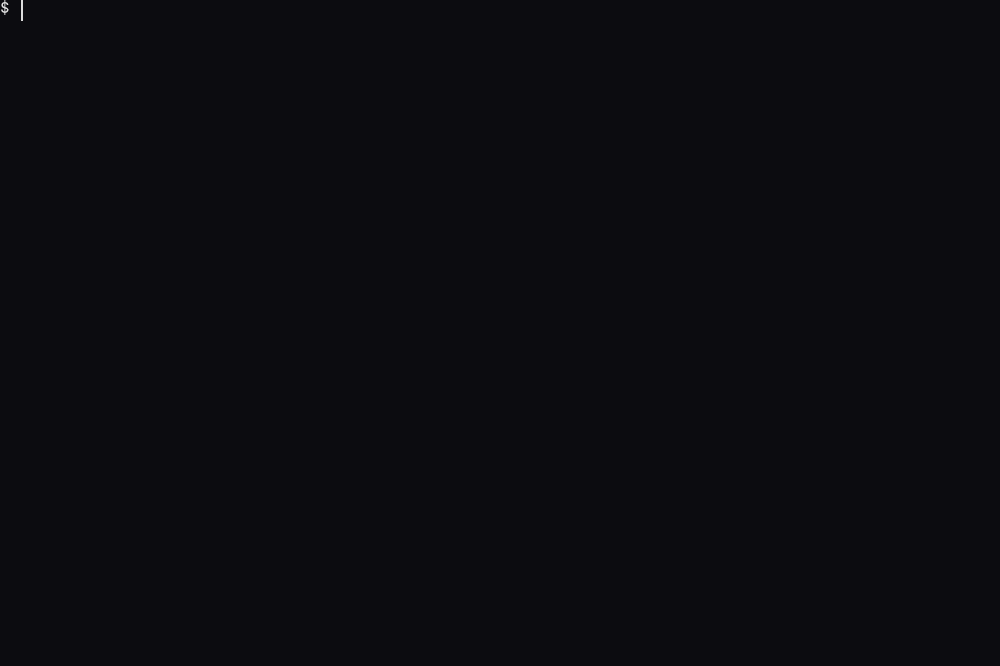
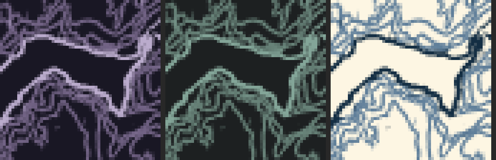
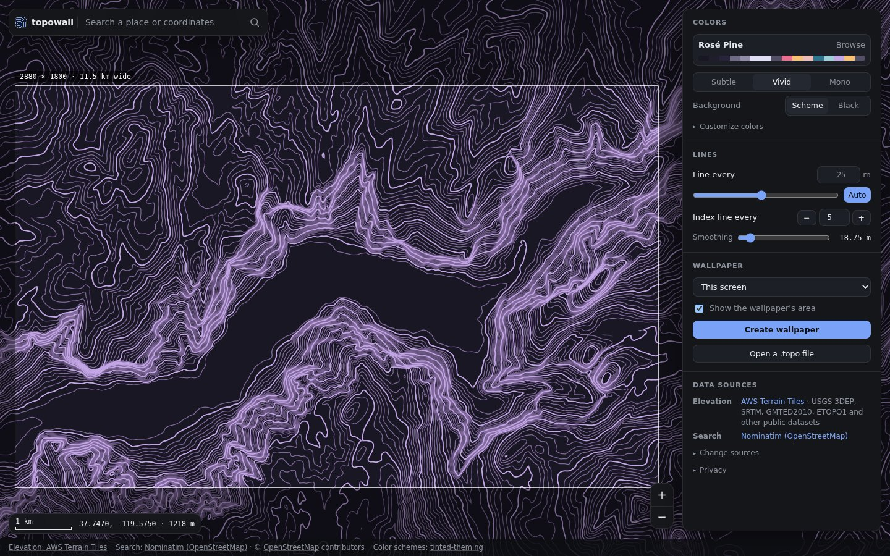
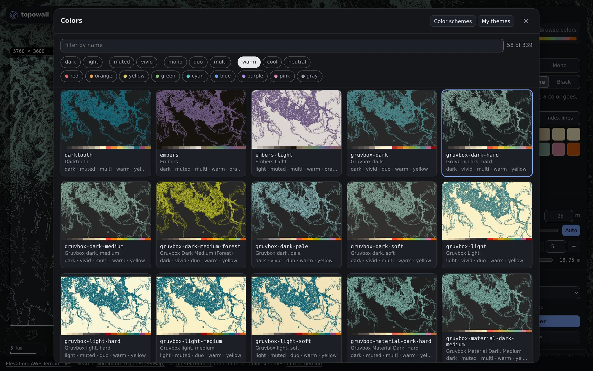

# topowall

Topographic contour wallpapers from real elevation data, rendered on the GPU.

Pick any place on Earth, pick your screen resolution, and pick your colors:
a theme, a terminal color scheme, the dominant colors of a photo, or your own
shader. Use it from the command line, or in your browser at
**[topography.dev](https://topography.dev)**: search any
place, pan and zoom a live contour map in your colors, and save a wallpaper.


- [Gallery](#gallery)
- [Install](#install)
- [Quick start](#quick-start)
- [CLI guide](#cli-guide)
- [Colors](#colors)
- [Line spacing](#line-spacing)
- [Web app guide](#web-app-guide)
- [The .topo format](#the-topo-format)
- [Development](#development)
- [Data and attribution](#data-and-attribution)

## Gallery

Five US national parks, each in five color styles: three popular color
schemes and two hex themes. Every image was made with
`--interval auto` by [`scripts/gallery.sh`](scripts/gallery.sh).

### 1. Great Smoky Mountains — Mount Le Conte and Clingmans Dome

24 km wide · `--center 35.610,-83.470` · auto spacing 50 m

| Solarized Dark | Rosé Pine | Catppuccin Mocha |
|---|---|---|
|  |  |  |
| **#3f5875 / #87abc0** | **#3e5d58 / #92aca0** | |
|  |  | |

### 2. Zion — Zion Canyon and Angels Landing

14 km wide · `--center 37.255,-112.955` · auto spacing 50 m

| Solarized Dark | Rosé Pine | Catppuccin Mocha |
|---|---|---|
|  |  |  |
| **#3f5875 / #87abc0** | **#3e5d58 / #92aca0** | |
|  |  | |

### 3. Yellowstone — Grand Canyon of the Yellowstone and Mount Washburn

24 km wide · `--center 44.750,-110.470` · auto spacing 25 m

| Solarized Dark | Rosé Pine | Catppuccin Mocha |
|---|---|---|
|  |  |  |
| **#3f5875 / #87abc0** | **#3e5d58 / #92aca0** | |
|  |  | |

### 4. Grand Canyon — the inner canyon and the Colorado River

24 km wide · `--center 36.120,-112.080` · auto spacing 100 m

| Solarized Dark | Rosé Pine | Catppuccin Mocha |
|---|---|---|
|  |  |  |
| **#3f5875 / #87abc0** | **#3e5d58 / #92aca0** | |
|  |  | |

### 5. Yosemite — Yosemite Valley, El Capitan to Half Dome

18 km wide · `--center 37.738,-119.575` · auto spacing 50 m

| Solarized Dark | Rosé Pine | Catppuccin Mocha |
|---|---|---|
|  |  |  |
| **#3f5875 / #87abc0** | **#3e5d58 / #92aca0** | |
|  |  | |

## Install

Download the build for your system from the
[latest release](https://github.com/gonzalezerik/topowall/releases/latest).
Each download contains only the `topowall` program and its licenses.

**Graphics:** topowall runs on dedicated and integrated GPUs alike: Intel
(HD, UHD, Iris, Arc), AMD Radeon (including laptop and desktop APU graphics),
NVIDIA, and Apple. It uses Vulkan, Metal, DX12 or OpenGL 3.3, whichever
works, and falls back to software rendering on the CPU when there's no GPU
driver at all. See [Choosing a GPU](#choosing-a-gpu).

### Linux

Needs glibc 2.35 or newer and a graphics driver. Intel and AMD GPUs use the
Mesa drivers most distributions install by default; NVIDIA GPUs use the NVIDIA
driver or Mesa.

```sh
# x86_64 — for ARM64, replace x86_64 with aarch64 in both places
curl -L https://github.com/gonzalezerik/topowall/releases/latest/download/topowall-x86_64-unknown-linux-gnu.tar.gz | tar xz
sudo install topowall-x86_64-unknown-linux-gnu/topowall /usr/local/bin/
topowall --version
```

**musl-based distributions** (Alpine, Void Linux musl, Chimera, postmarketOS)
use the musl build. It needs `libgcc` and your graphics drivers. On Alpine
(use `doas` or `sudo`):

```sh
# Intel graphics; for AMD use mesa-vulkan-ati instead of mesa-vulkan-intel
doas apk add curl libgcc vulkan-loader mesa-vulkan-intel mesa-dri-gallium mesa-egl

# x86_64 — for ARM64, replace x86_64 with aarch64 in both places
curl -L https://github.com/gonzalezerik/topowall/releases/latest/download/topowall-x86_64-unknown-linux-musl.tar.gz | tar xz
doas install topowall-x86_64-unknown-linux-musl/topowall /usr/local/bin/
topowall --version
```

### macOS

Works on Apple Silicon and Intel Macs through Metal.

```sh
# Apple Silicon — on an Intel Mac, replace aarch64 with x86_64 in both places
curl -L https://github.com/gonzalezerik/topowall/releases/latest/download/topowall-aarch64-apple-darwin.tar.gz | tar xz
sudo mkdir -p /usr/local/bin
sudo install topowall-aarch64-apple-darwin/topowall /usr/local/bin/
topowall --version
```

If you downloaded the archive in a browser instead, macOS may block the
unsigned program. Clear the flag with `xattr -d com.apple.quarantine topowall`.

### Windows

Uses DX12 (Windows 10 or newer) with your Intel, AMD or NVIDIA graphics
driver, and falls back to Vulkan, OpenGL or Windows' built-in software
renderer.

In PowerShell:

```powershell
# x86_64 — on ARM64 PCs (e.g. Snapdragon), replace x86_64 with aarch64 in both places
$dir = "$env:LOCALAPPDATA\topowall"
Invoke-WebRequest https://github.com/gonzalezerik/topowall/releases/latest/download/topowall-x86_64-pc-windows-msvc.zip -OutFile "$env:TEMP\topowall.zip"
Expand-Archive "$env:TEMP\topowall.zip" -DestinationPath $dir -Force
$bin = "$dir\topowall-x86_64-pc-windows-msvc"
[Environment]::SetEnvironmentVariable("Path", [Environment]::GetEnvironmentVariable("Path", "User") + ";$bin", "User")
```

Open a new terminal and run `topowall --version`. If Windows SmartScreen warns
about the unsigned program, choose **More info → Run anyway**.

### Web app

Nothing to install: open [topography.dev](https://topography.dev).

To run it yourself, download (releases from v0.2.2 on)
[`topowall-web.zip`](https://github.com/gonzalezerik/topowall/releases/latest/download/topowall-web.zip),
extract it, and serve the folder with any static file server. With Python:

```sh
cd topowall-web
python3 -m http.server 8000     # Windows: py -m http.server 8000
```

Then open <http://localhost:8000/>. To host it on a server, see
[Hosting the web app](#hosting-the-web-app).

### Build from source

On any system with [Rust](https://rustup.rs) 1.88 or newer:

```sh
git clone https://github.com/gonzalezerik/topowall
cd topowall
cargo install --path crates/cli
```

## Quick start

```sh
# 1. Download elevation for an area: its centre, width in km, and your screen size
topowall fetch --center 37.738,-119.575 --width-km 18 --size 2880x1800 -o yosemite.topo

# 2. Render a wallpaper
topowall render yosemite.topo --palette rose-pine -o wallpaper.png
```

Set `wallpaper.png` as your wallpaper however your desktop does it.

## CLI guide

```
topowall fetch     Download elevation for an area into a .topo heightmap
topowall render    Render contours to PNG or JPEG
topowall theme     Write a theme file from a palette or image
topowall info      Show details about an elevation file
topowall themes    List built-in themes
topowall palettes  List built-in color schemes with color strips and tags
topowall preview   Draw a color scheme on a map in the terminal, or browse all of them live
topowall gpus      List the GPUs topowall can use
```

Every command has `--help`.

### `topowall fetch`

Downloads elevation for a rectangle centred on a point and saves it as a
[`.topo`](#the-topo-format) heightmap.

| Option | Meaning |
|---|---|
| `--center LAT,LON` | Centre of the area in decimal degrees, e.g. `37.738,-119.575` (west and south are negative). |
| `--width-km KM` | Width of the area. The height follows from `--size`'s aspect ratio. |
| `--size WxH` | Heightmap size in pixels. Use your screen resolution. |
| `--smooth-m M` | Smoothing in metres (default `18.75`). Higher values give calmer, flowing lines; use roughly 2–3× the metres per pixel. |
| `--zoom Z` | Tile zoom level (default: matched to the resolution). |
| `--max-tiles N` | Refuse areas that need more tiles than this (default `1500`). |
| `-o FILE` | Output `.topo` file. |

**Choosing the area.** Metres per pixel is `width-km × 1000 ÷ width`. Around
5–15 m per pixel gives detailed wallpapers. For a bigger screen, raise both
`--size` and `--width-km` to show more land at the same sharpness rather than
stretching a smaller map:

```sh
topowall fetch --center 37.738,-119.575 --width-km 18   --size 2880x1800 -o laptop.topo   # 6.25 m/px
topowall fetch --center 37.738,-119.575 --width-km 38.4 --size 5120x2160 -o desktop.topo  # 7.5 m/px
```

Find coordinates by right-clicking a spot in most online maps.

### `topowall render`

```sh
topowall render INPUT [color options] [--size WxH] [--scale M] [--interval M|auto] -o OUTPUT
```

`INPUT` can be a `.topo` file, a GeoTIFF (including Cloud Optimized GeoTIFFs
such as Copernicus GLO-30 or USGS 3DEP), an SRTM `.hgt` tile, or a
Terrarium-encoded PNG tile.

| Option | Meaning |
|---|---|
| `--theme NAME\|FILE` | A built-in theme or a theme file. Default: `graphite`. |
| `--palette NAME\|FILE` | Generate colors from a color scheme ([Palettes](#palettes)). |
| `--palette-from-image IMAGE` | Generate colors from an image ([Images](#images)). |
| `--style subtle\|vivid\|mono` | How a palette becomes line colors (default `subtle`). |
| `--accent COLOR` | Which palette color the lines use: `auto`, `blue`, `cyan`, `green`, `red`, `magenta`, `yellow`, `orange`, `0`–`15`, or any color. |
| `--background palette\|black` | Keep the palette's background or use black. |
| `--interval M\|auto` | Metres between lines ([Line spacing](#line-spacing)). |
| `--index-every N` | Every Nth line is an index line. |
| `--size WxH` | Output size (default: the heightmap's size). |
| `--scale M` | Fixed metres per output pixel instead of filling the output. |
| `--save-theme FILE` | Also write the theme that was used. |
| `--quality Q` | JPEG quality 1–100 (default `90`). |
| `--gpu N\|NAME` | Render on a specific GPU ([Choosing a GPU](#choosing-a-gpu)). |
| `--backend API` | `auto`, `vulkan`, `metal`, `dx12` or `gl`. |
| `-o FILE` | `.png`, `.jpg` or `.jpeg`. |

When the heightmap and output have different aspect ratios, the map is scaled
to cover the output and centred.

### `topowall theme`

Takes the same color and spacing options as `render` but writes a theme file
instead of an image, so you can start from a palette and fine-tune by hand:

```sh
topowall theme --palette nord --style vivid --interval 25 -o nord.toml
```

### Choosing a GPU

topowall picks a GPU automatically: a dedicated GPU first, then an integrated
one, using your system's native graphics API (DX12 on Windows, Metal on macOS,
Vulkan on Linux) before OpenGL. If a GPU or API fails, it tries the next one,
and when nothing else works it renders on the CPU, which is slower.

See what's available:

```
$ topowall gpus
 0  AMD Radeon 8060S Graphics (RADV STRIX_HALO)  [integrated GPU, Vulkan]
 1  AMD Radeon 8060S Graphics (radeonsi, strix_halo, ACO, DRM 3.64, 7.2.4)  [GPU, Gl]
 2  llvmpipe (LLVM 21.1.8, 256 bits)  [software (CPU), Vulkan]

topowall will use: AMD Radeon 8060S Graphics (RADV STRIX_HALO) (integrated GPU, Vulkan)
```

Pick one yourself with `--gpu`, by number or by part of its name, or restrict
the graphics API with `--backend`:

```sh
topowall render map.topo --gpu intel -o out.png     # e.g. the integrated GPU on a laptop that also has an NVIDIA GPU
topowall render map.topo --gpu 1 -o out.png
topowall render map.topo --backend gl -o out.png    # older GPUs without Vulkan or DX12
```

The environment variables `TOPOWALL_GPU` and `TOPOWALL_BACKEND` set the same
options for every command.

If a heightmap is larger than a GPU's texture size limit (8192 or 16384 pixels
on many integrated GPUs), topowall shrinks it to fit and tells you.

### `topowall info`

```
$ topowall info yosemite.topo
size       2880 x 1800
elevation  1173.1 .. 3013.1 m
resolution 6.25 m/px (18.00 x 11.25 km)
extent     W -119.67723  S 37.68713  E -119.47277  N 37.78887
source     AWS Terrain Tiles (terrarium) z14
```

## Colors

There are four ways to color a map, from quickest to most control.

### Palettes

339 color schemes are built in (`topowall palettes`), including Solarized,
Rosé Pine, Catppuccin, Gruvbox, Nord, Dracula, Tokyo Night, Everforest and
Kanagawa:

```sh
topowall render yosemite.topo --palette catppuccin-mocha -o out.png
```

**Finding one** in the terminal:

```sh
topowall preview                         # browse all 339, live, and pick one
topowall palettes                        # every scheme: name, color strip, tags
topowall palettes rose                   # names containing "rose"
topowall palettes --filter dark,cool     # schemes with all of these tags
topowall preview rose-pine               # draw one scheme on a map, right in the terminal
topowall preview gruvbox-dark-hard --style vivid
topowall preview nord --input yosemite.topo --size 100x40   # your own map
topowall render yosemite.topo --palette random -o out.png   # prints which one it picked
```

**`topowall preview`** with no name opens an interactive browser: the map
redraws live as you move, so you see the actual contour lines, not just a
color strip.



| Key | Does |
|---|---|
| Type | Filter by name or tag (`dark cool`, `gruv hard`) |
| `↑` `↓` `PgUp` `PgDn` `Home` `End` | Move through the list |
| `Tab` | Cycle line style: subtle → vivid → mono |
| `Shift+Tab` | Toggle black background |
| `Enter` | Pick it |
| `Esc` | Clear the filter, then quit |

Picking a scheme prints its flags (`--palette gruvbox-dark-hard --style vivid`)
to stdout, so it composes with other commands:

```sh
topowall render yosemite.topo $(topowall preview) -o wallpaper.png
```

Add `--input map.topo -o wallpaper.png` to render the wallpaper directly from
whatever you pick, instead of just printing the flags:

```sh
topowall preview --input yosemite.topo -o wallpaper.png --wallpaper-size 3840x2160
```

A single named preview (`topowall preview rose-pine`) still works exactly as
before, and composes the same way:



`preview` renders the real map with the same GPU renderer as `render`, shrunk
to terminal cells: each cell is a `▀` whose foreground and background colors
are two pixels. It needs a terminal with 24-bit color. Without `--input` it
draws a built-in sample of Yosemite Valley. `--size` is in cells (default
`60x30`; the interactive browser always fills the terminal). It takes the
same color options as `render`, and the name can be a theme too
(`topowall preview hypsometric`).

Color strips show when `palettes` prints to a terminal; use `--color always`
to keep them when piping (e.g. into `less -R`), or `--color never`. Mistyped
names get suggestions: `--palette catpucin` answers with the four Catppuccin
flavors.

Tags are computed from each scheme's colors — specifically the ones a map
actually ends up with, i.e. the background and the line color `--accent auto`
would pick, not just the palette's raw color list:

| Tag | Meaning |
|---|---|
| `dark`, `light` | background lightness |
| `muted`, `vivid` | saturation of the line color |
| `mono`, `duo`, `multi` | how far the scheme's accent hues spread around the color wheel |
| `warm`, `cool`, `neutral` | temperature of the line color |
| `red` … `pink`, `gray` | hue family of the line color (`gray` when it has essentially no hue) |

You can also point to your terminal's config, and topowall reads its colors:

| Source | Example |
|---|---|
| pywal | `--palette ~/.cache/wal/colors.json` |
| Alacritty | `--palette ~/.config/alacritty/alacritty.toml` |
| Kitty | `--palette ~/.config/kitty/theme.conf` |
| foot | `--palette ~/.config/foot/foot.ini` |
| Ghostty | `--palette ~/.config/ghostty/config` |
| Xresources | `--palette ~/.Xresources` |
| iTerm2 | `--palette Theme.itermcolors` |
| Windows Terminal | `--palette settings.json` |
| base16 / tinted-theming | `--palette scheme.yaml` |

The file needs a background color or ANSI colors. Configs that use the
terminal's default colors have nothing to read.

How palette colors are used:

- **`--style subtle`** (default) keeps the accent's hue but lowers its
  saturation, and sets the lines' lightness relative to the background. The
  result is calm and easy to live with.
- **`--style vivid`** uses the accent color as-is for index lines.
- **`--style mono`** uses the foreground color only.
- **`--accent`** picks the hue. `auto` prefers blue, then cyan, green, magenta,
  yellow and red, skipping colors that are too gray.

### Images

Pull colors from a photo:

```sh
topowall render yosemite.topo --palette-from-image sunset.jpg -o out.png
```

topowall groups the image's pixels into 8 dominant colors (k-means in OKLab).
The darkest becomes the background and the most colorful, common colors become
accents. `--style`, `--accent` and `--background` work the same as with
palettes.

### Themes

A theme is a small TOML file. Built in: `graphite`, `3e5d58-92aca0`,
`3f5875-87abc0`, `hypsometric` ([`themes/`](themes)).

```toml
name = "My theme"
background = "#000000"

[[lines]]              # a tier of contour lines
every = 20             # metres between lines
color = "#3e5d58"      # #rgb, #rrggbb, #rrggbbaa or oklch(L C H)
width = 1.25           # pixels
opacity = 1.0          # optional
offset = 0             # optional: shift lines by this many metres

[[lines]]              # later tiers draw on top of earlier ones
every = 100
width = 1.8
color = [              # a ramp: color changes with elevation
  { at = "0%",   color = "oklch(0.65 0.08 190)" },   # % of the map's elevation range
  { at = 2500,   color = "#92aca0" },                # or metres
  { at = "100%", color = "oklch(0.88 0.07 80)" },
]
```

A theme can have up to 8 line tiers and 32 color stops in total.

Colors are sRGB. `oklch()` is handy for adjusting lightness (`L`, 0–1) and
color strength (`C`, about 0–0.37) without changing the hue (`H`, degrees).

### Custom shaders

For complete control, a theme can replace the shading function with WGSL:

```toml
shader = "slope-glow.wgsl"   # relative to the theme file
```

```wgsl
fn shade(s: ShadeInput) -> vec4<f32> {
    // s.elevation  metres
    // s.slope      metres of elevation change per output pixel
    // s.px, s.uv   output pixel position, and position from 0 to 1
    // s.elev_min, s.elev_max
    // Helpers: contour_coverage(h, slope, interval, width), tier_count(),
    // tier(i) and tier_color(i, h) for the theme's [[lines]], params.background
    ...
}
```

[`examples/slope-glow.wgsl`](examples/slope-glow.wgsl) adds a glow on steep
terrain. The full shader is
[`crates/render/src/shaders/contour.wgsl`](crates/render/src/shaders/contour.wgsl).
Shader errors are reported with the line and column.

## Line spacing

Spacing is adjustable everywhere:

| Where | How |
|---|---|
| CLI | `--interval 50` sets metres between lines; every tier scales together, so index lines keep their ratio. `--index-every 4` makes every 4th line an index line. |
| CLI | `--interval auto` picks a round interval so lines on typical terrain sit about 6 pixels apart at your output size. |
| Theme files | `every = …` on each `[[lines]]` tier. |
| GUI | The **Spacing** slider, number field and **Auto** button, plus the index-line stepper. |

Steep terrain or small images need wider spacing; otherwise lines merge into
solid bands. `auto` handles this for you: in the gallery it chose 25 m for
Yellowstone's plateau and 100 m for the Grand Canyon.

## Web app guide



The web app draws contour maps of anywhere on Earth, live, on your own device
(WebGL2). It builds elevation the same way as `topowall fetch` and uses a port
of the CLI's shader, so a wallpaper saved in the browser matches what
`topowall render` makes from the same settings.

- **Move around:** drag to pan; scroll, pinch or double-click to zoom
  (Shift+double-click zooms out). The pad and `+`/`−` buttons to the left of
  the map do the same, and so do the arrow keys and `+`/`-` when the map has
  focus.
- **Search:** type coordinates (`37.738, -119.575`, `37°44'17"N 119°34'30"W`)
  to jump straight there, or a place name and press Enter to ask the search
  service. Results zoom to fit the place.
- **Colors:** **Browse** opens all 339 color schemes, each drawn as a small
  preview of the area you're looking at. Filter by name or by tag (dark,
  light, muted, vivid, warm, cool, hue…), and pick **Subtle**, **Vivid** or
  **Mono** lines and the scheme's background or black. Every color in the
  scheme is shown as a swatch: choose **Background**, **Lines** or
  **Index lines** and click a swatch to use it there.

  

  **Pick any color** shows a full color wheel for the background and every
  line tier, always in view — not hidden behind a click. **+ Add color** picks
  a color of your own and adds it as a swatch; **Remove colors** takes them
  back out. Doing either to a built-in scheme starts your own copy of it
  automatically, so nothing you're browsing is ever changed under you.
- **My themes:** **Save as my theme** keeps the colors on screen, with their
  swatches, as your own theme. Rename it, add or remove swatches, and it saves
  as you go. Themes live in your browser only; **Back up** downloads them as a
  file and **Restore** opens one, so you can move them to another browser.
- **Lines:** **Auto** picks the spacing for the current zoom, or set it
  yourself. **Index line every** sets how many lines make a bold one.
  **Smoothing** softens small bumps in the data (same as `--smooth-m`).
- **Wallpaper:** choose a size ("This screen" uses your display's native
  resolution). The outlined area on the map is what the wallpaper covers.
  **Create wallpaper** renders it at full resolution and lets you download the
  PNG, the theme as `theme.toml`, and the `topowall fetch` / `topowall render`
  commands that make the same image.
- **Open a .topo file:** view and color a heightmap made with `topowall fetch`.
- **Share a view:** the address bar keeps the place, zoom and colors, so a
  link opens the same map.

### Data sources and privacy

The app has no server-side code. Everything is drawn in your browser, and
it contacts only the services shown under **Data sources**:

| What | Default | Can be changed to |
|---|---|---|
| Elevation tiles | [AWS Terrain Tiles](https://registry.opendata.aws/terrain-tiles/) | any 256 px Web Mercator PNG tiles in Terrarium or Terrain-RGB encoding, from an `https` URL that allows cross-origin requests |
| Place search | [Nominatim](https://nominatim.org/) (OpenStreetMap) | [Photon](https://photon.komoot.io/), any Nominatim- or Photon-compatible service, or off (coordinates only) |

- No accounts, cookies, analytics or tracking.
- Elevation tiles are requested without a referrer. Place searches are sent
  only when you press Enter, at most once a second, with only the site's
  address as the referrer. Like any website, these services see your IP
  address.
- The place and zoom live in the part of the address after `#`, which browsers
  never send to servers.
- Settings and your themes are kept in your browser's local storage.
  **Forget my settings** clears settings; delete themes one by one. Theme
  backups are files you download and open yourself; nothing is uploaded.
- The page's Content-Security-Policy lets it run only its own scripts and
  styles.

### Accessibility

The web app is built to meet [WCAG 2.2](https://www.w3.org/TR/WCAG22/) level AA:

- Everything works from the keyboard, in a logical order, with a visible focus
  ring. A skip link jumps to the settings.
- The map can be moved and zoomed with buttons as well as by dragging,
  scrolling or pinching, and with the arrow and `+`/`-` keys when it has focus.
- Screen readers get labeled controls, standard radio group, tab and
  combobox patterns, and spoken updates of where the map is, its elevation
  and colors. Every color swatch says what it will be used for.
- Text and control boundaries keep enough contrast, targets are at least
  24×24 px, the layout reflows down to 320 px wide, and it respects reduced
  motion and forced-colors (high contrast) modes.

It's checked with [axe-core](https://github.com/dequelabs/axe-core) in every
state of the app (no violations) plus keyboard, reflow, text-spacing and
target-size checks. Please
[report anything that gets in your way](https://github.com/gonzalezerik/topowall/issues/new?title=Accessibility%3A%20).

### Hosting the web app

`scripts/web-dist.sh OUT_DIR` assembles the app into a folder of static files
that works under any URL path. [`deploy/Containerfile`](deploy/Containerfile)
builds a small image that serves it:

```sh
podman build -f deploy/Containerfile -t topowall-web .
podman run --rm -p 8080:8080 --read-only --tmpfs /tmp --cap-drop ALL topowall-web
# open http://localhost:8080/
```

The image runs nginx as a non-root user and needs only a writable `/tmp`
([`deploy/nginx.conf`](deploy/nginx.conf)). It keeps no access logs, answers
only `GET` and `HEAD`, and sends a strict
Content-Security-Policy and related security headers. `/healthz` returns `ok`
for health checks.

### Color picker

Every color control uses topowall's color picker:


- Drag the **hue ring**, and drag inside the **square** for saturation and
  brightness.
- Type a **hex code** (`#3e5d58`, `3e5d58`, `#fff` or `#3e5d5880`) or an
  **OKLCH** value, and both markers jump to that color's exact position.
- Edit **H/S/B**, **R/G/B** or **A** directly. Up/Down arrows nudge a value,
  and Shift+arrow nudges it by more.
- The **preview square** shows the new color on top and the previous color
  below. Click the previous color to go back.
- With keyboard focus on the wheel, arrows move the markers.
- Use the **eyedropper** to pick from the screen (Chromium-based browsers).
- Recently used colors are kept as swatches.
- **Enter** or **Apply** keeps the color; **Esc**, **Cancel** or clicking
  outside restores the previous one.

The picker is a standalone web component you can use in other pages:

```html
<script type="module" src="web/src/color-picker.js"></script>

<topo-color-input value="#3e5d58" alpha></topo-color-input>   <!-- swatch that opens a popover -->
<topo-color-picker value="#87abc0"></topo-color-picker>        <!-- the panel on its own -->

<script type="module">
  const input = document.querySelector("topo-color-input");
  input.addEventListener("input", (e) => console.log(e.detail.hex));  // live, while dragging
  input.addEventListener("change", (e) => console.log(e.detail.hex)); // committed
</script>
```

Attributes: `value`, `alpha` (show opacity), `theme="light|dark"`,
`label` (accessible name for the swatch button, e.g. `label="Background color"`),
and `actions` (Apply/Cancel buttons; on by default in the popover). The picker
follows the system light/dark setting. A demo is in
[`web/demo/color-picker.html`](web/demo/color-picker.html).

## The `.topo` format

A `.topo` file is a 16-bit grayscale PNG (row 0 = north) with an iTXt chunk
named `topowall` holding JSON:

```json
{ "version": 1, "min_m": 1173.13, "range_m": 1839.97, "m_per_px": 6.25,
  "extent": { "west": -119.677, "south": 37.687, "east": -119.473, "north": 37.789 },
  "source": "AWS Terrain Tiles (terrarium) z14" }
```

Elevation in metres = `min_m + value / 65535 × range_m`. Any image viewer can
open the file as a grayscale height image.

## Development

```sh
# Needs Rust 1.88+ (Nix users can run `nix develop` for a ready toolchain)
cargo test --workspace      # Rust tests, including renders on your GPU
# pick the adapter for the GPU tests, e.g. TOPOWALL_BACKEND=gl or TOPOWALL_GPU=intel
cargo clippy --workspace -- -D warnings
node --test web/test/*.test.js   # web tests: color math, scheme colors vs the CLI, coordinates, saved themes

# Browser tests: serve the repo, then open these pages (the title says PASS/FAIL)
python3 -m http.server 8000
#   http://localhost:8000/web/test/picker.test.html
#   http://localhost:8000/web/test/parity.test.html   (renders for comparison with the CLI)
#   http://localhost:8000/web/test/terrain.test.html  (browser-built elevation vs `topowall fetch`)
# The app itself: http://localhost:8000/web/app/

cargo build --release
scripts/gallery.sh          # regenerate docs/gallery
cargo run -p topowall-kit --example palette-catalog   # regenerate crates/kit/palettes/palettes.json
scripts/web-presets.sh      # regenerate the web app's palette data and web test fixtures
scripts/web-dist.sh dist    # assemble the web app as static files
```

Layout:

```
crates/kit       shared with streetwall: colors, palettes, GPU selection, safe file writes
crates/core      elevation readers, tile fetching, resampling, .topo format
crates/render    wgpu renderer, WGSL shader, themes, palette → theme, spacing
crates/cli       the topowall command
web/src          color math, color picker, PNG/.topo readers, terrain building, search, WebGL renderer, themes
web/app          the web app
deploy/          container image and nginx config for hosting the web app
themes/          built-in themes
```

## Data and attribution

`topowall fetch` uses [AWS Terrain Tiles](https://registry.opendata.aws/terrain-tiles/),
which combine public elevation datasets including USGS 3DEP, SRTM, GMTED2010
and ETOPO1. If you publish images made from this data, follow the
[attribution guidance](https://github.com/tilezen/joerd/blob/master/docs/attribution.md).
Resolution varies by region: about 10 m in the United States and roughly
30–90 m elsewhere. Downloaded tiles are cached in
`~/.cache/topowall/`.

The web app's place search uses OpenStreetMap data through Nominatim or Photon:
© [OpenStreetMap contributors](https://www.openstreetmap.org/copyright), available
under the Open Database License. Follow each service's usage policy if you host
the app for others.

Built-in color schemes come from
[tinted-theming/schemes](https://github.com/tinted-theming/schemes) (MIT); see
[`crates/kit/palettes`](crates/kit/palettes).

## License

[MIT](LICENSE) © Erik Gonzalez
